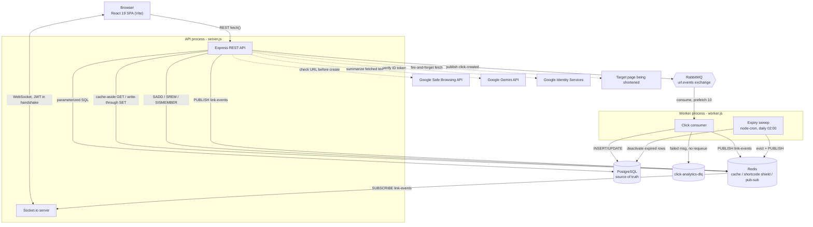

# Architecture

This document covers the high-level design, the components involved, the
design patterns used and where, and how data actually moves through the
system for the flows that matter most. For the literal folder/file layout,
see the "Project structure" section of the root [`README.md`](../README.md);
this document is about how the pieces fit together, not where they live on
disk.

## System overview

Two Node.js processes sit behind a React SPA: an **API process**
(`server.js`) handling REST + WebSocket traffic, and a **worker process**
(`worker.js`) consuming background work. They share three pieces of
infrastructure - PostgreSQL (source of truth), Redis (cache, a negative
cache for shielding, and a pub/sub bus), and RabbitMQ (async click
analytics) - and talk to three external APIs (Google Safe Browsing, Google
Gemini, Google Identity Services) that are all wired to fail open: if any of
them is slow, misconfigured, or down, the core "create and redirect a link"
path is never affected, only the optional feature layered on top of it.

The two-process split isn't fixed at deploy time - `RUN_WORKER_INLINE=true`
folds the worker's responsibilities into the API process for hosts that
only offer one always-on process slot (see Deployment in the root README).
Every pattern below that depends on "the worker" specifically still works
in that mode; nothing is hard-coded to assume two processes.

## High-level design

### Component responsibilities

| Component | Responsibility |
|---|---|
| **API process** (`server.js` → `app.js`) | REST endpoints, Socket.io server, everything on the request/response hot path |
| **Worker process** (`worker.js`) | Consumes `click-analytics` off RabbitMQ, runs the daily expiry sweep - nothing here is on any user-facing request path |
| **PostgreSQL** | Source of truth for `users`, `urls`, `click_events`. Plain `pg`, no ORM, hand-written parameterized SQL |
| **Redis** | Three distinct roles sharing one connection: cache-aside store for redirects, a Set-based negative cache ("shortcode shield") that shields Postgres from lookups on codes that don't exist, and the pub/sub bus that carries link lifecycle events to Socket.io |
| **RabbitMQ** | One topic exchange (`url.events`), one durable queue (`click-analytics`) with a dead-letter exchange/queue behind it. Decouples the redirect's hot path from the analytics write |
| **Socket.io** | Pushes `link:click` / `link:deleted` / `link:permanentlyDeleted` / `link:enriched` to whichever dashboard has that link's owner connected, scoped to a per-user room |

## Design patterns

These are the recurring patterns worth knowing before changing anything in
this codebase - not an exhaustive catalog, but the ones that shape how a
change should be made.

### Cache-aside with write-through (`services/cache.service.js`, `services/url.service.js`)

Redirect lookups (`getUrlByCode`) check Redis first, fall through to
Postgres on a miss, then populate the cache. Creates (`createShortUrl`) skip
the miss entirely - they write to Postgres and Redis in the same request,
so the very first redirect after creation is already a cache hit.

### Negative cache / shielding (`config/redis.js`)

A plain Redis Set (`SADD`/`SREM`/`SISMEMBER`) that answers one question
fast: "has this short code ever existed?" A definite "no" skips Postgres
entirely on the redirect path - useful against scanning/enumeration and
plain typos. It fails open: any Redis error is treated as "maybe exists"
and falls through to Postgres, so a broken shield only costs the
optimization, never causes a false 404 on a real link. (This was originally
built on RedisBloom's Cuckoo filter, which needs a module Upstash's managed
Redis doesn't load - rebuilt on a plain Set so it works on any
Redis-compatible host, at the cost of storing real short codes instead of
compact fingerprints. Negligible at this app's scale, and a Set is also an
*exact* membership test - zero false positives, which a probabilistic
filter can't offer.)

### Fail-open on every optional dependency

The same posture shows up four separate times, deliberately: Safe Browsing
(no key, or an outage → skip the check, allow the URL), Gemini (no key, or
a failure → summary/keyTopics stay null), the shortcode shield (Redis error
→ assume "maybe exists"), and the cache (miss or error → read Postgres
directly). None of these third-party or optional dependencies can ever take
down link creation or redirection - they can only ever fail to provide their
own enhancement.

### Fire-and-forget background enrichment (`services/url.service.js`)

`enrichLinkMetadata()` runs unawaited after `createShortUrl` returns - a
slow or unreachable target site must never add latency to the create
response the user is waiting on. See "Creating a link" below for how its
result actually reaches an open dashboard afterward.

### Retry with failure classification (`services/pageMetadata.service.js`)

Page-fetch failures are split into transient (`timeout`, `network_error` -
worth exactly one retry) and deterministic (`blocked_status`, `non_html`,
`ssrf_blocked` - retrying changes nothing, since the site will block the
retry the same way). Every outcome is logged with its specific reason and
counted in `page_enrichment_total`, so failures are diagnosable from
metrics/logs instead of a silent gap in the data.

### Producer/consumer with a dead-letter queue (`config/rabbitmq.js`, `services/queue.service.js`, `services/workerTasks.service.js`)

The redirect controller publishes a click event and returns immediately -
it never waits on RabbitMQ or Postgres for the analytics write. The worker
consumes independently, `prefetch(10)` at a time. A message that throws
during processing is `nack`'d without requeue, which routes it to
`click-analytics-dlq` via the `click-analytics-dlx` fanout exchange, rather
than retrying forever or silently dropping it.

### Pub/sub decoupling "who processed this" from "who's watching" (`services/realtime.service.js`, `realtime/socket.js`)

Every link lifecycle event (click, soft delete, permanent delete,
enrichment complete) is `PUBLISH`ed to a single Redis channel
(`link-events`) as `{ type, shortCode, userId, ...fields }`. The API
process's Socket.io server is the only subscriber, and it fans each event
out only to the room for that event's `userId`. This is what makes the
real-time layer indifferent to deployment topology: the event might have
been produced by the worker process, the API process, or a cron callback -
whichever process happens to update Postgres just publishes, and whichever
process is running Socket.io just relays. Swapping `RUN_WORKER_INLINE`
doesn't change a single line of this code path.

### Middleware chain (Express)

Global order in `app.js`: `metrics → helmet → cors → morgan → json body
parser → routes → 404 handler → error handler`. Per-route, e.g. `POST
/api/shorten`: `optionalAuth → shortenLimiter → validateShortenRequest →
checkUrlSafety → shortenUrl`. Each middleware does exactly one job and can
short-circuit the rest (a validation failure never reaches the Safe
Browsing check; the Safe Browsing check never reaches the controller if the
URL is flagged).

### Service layer

Controllers stay thin - parse the request, call a service function, shape
the response, `next(err)` on failure. SQL and business logic live in
`services/`. Nothing queries Postgres directly from a controller.

### Two-tier delete (`services/url.service.js`)

`deactivateLink` (soft) sets `is_active = false`. `permanentlyDeleteLink`
(hard) only runs its `DELETE` when `is_active = false` is already true -
enforced in the SQL `WHERE` clause itself, so it's structurally impossible
to hard-delete a link that hasn't been soft-deleted first, regardless of
what the UI does or doesn't check.

### Distributed ID generation (`utils/snowflake.js`)

41-bit timestamp + 10-bit worker ID + 12-bit sequence, Base62-encoded for
the public short code. Structurally collision-free across multiple API
replicas with zero coordination between them - no central counter, no
round trip to reserve an ID.

### The unique constraint as the real concurrency backstop

The shortcode shield and a `SELECT` are checked before an insert, but
they're an optimization, not the correctness guarantee - the actual
`UNIQUE` constraint on `urls.short_code` is what makes a race-condition
double-create structurally impossible, caught in application code as
Postgres error `23505`.

### Content negotiation on errors (`utils/htmlError.js`)

`sendError()` checks whether `Accept` includes `text/html` and branches: a
real browser navigating to a dead/expired short link gets a branded HTML
page, an API client gets `{ error: message }` JSON. One function, one
decision point, used by the redirect controller, the 404 handler, and the
global error handler alike.

### Parallel auth strategies unified behind one JWT (`services/auth.service.js`)

Password (bcrypt) and Google ID-token verification are two independent
paths into the same `toUserResponse()` + `signToken()` finish line.
`password_hash` is nullable for Google-only accounts, which is why `login()`
explicitly checks `!row.password_hash` before calling `bcrypt.compare` -
bcrypt throws on a null hash rather than returning `false`, and this was a
real crash caught during a hardening pass (see the root README's Roadmap).

### Distributed rate limiting (`middlewares/rateLimiter.middleware.js`)

`express-rate-limit` backed by `rate-limit-redis` rather than in-memory
counters, so the limit holds correctly across multiple API replicas instead
of each replica enforcing its own separate quota. Three independently
configured limiters (`shortenLimiter`, `redirectLimiter`, `authLimiter`),
each built lazily on first request rather than at module-import time, to
avoid a startup-ordering race with `connectRedis()`.

### SSRF guard as a pre-flight check (`utils/ssrfGuard.js`)

`assertPublicHostname()` runs before any outbound fetch that's triggered by
user-supplied input (page enrichment). It's a check, not a filter on the
response - the fetch never happens at all if the target resolves to a
private/internal address.

## Data flow walkthroughs

### Creating a link (`POST /api/shorten`)

1. `optionalAuth` reads the JWT if present, `shortenLimiter` applies the
   authenticated or anonymous rate limit accordingly.
2. `validateShortenRequest` checks `longUrl` is a real http(s) URL, and
   `customAlias`/`expiresInDays` against their constraints.
3. `checkUrlSafety` calls Google Safe Browsing (fails open on any error).
4. `createShortUrl`: a Snowflake ID is generated; either the custom alias
   or a Base62-encoded ID becomes the short code; the row is inserted.
5. The cache is populated write-through, and the code is added to the
   shortcode shield - both before the response is sent.
6. **The `201` response goes out here.** Everything below happens after.
7. `enrichLinkMetadata` runs, unawaited: fetch the target page (with one
   retry for transient failures), categorize it (always succeeds - see the
   shielding pattern above's sibling, hostname-based categorization needs
   no network call), summarize it with Gemini if a key is configured, then
   `UPDATE` the row.
8. `publishLinkEnriched` publishes to `link-events`. If the owner's
   dashboard is open, its Socket.io connection is in the room for that
   `userId`, receives `link:enriched`, and merges the new fields into the
   table live - no reload needed, regardless of how many seconds step 7
   actually took.

### Redirecting (`GET /:code`)

1. `redirectLimiter` applies the per-IP limit for this route specifically.
2. `getUrlByCode`: check Redis (cache-aside). On a hit that's still
   unexpired, return immediately.
3. On a miss, check the shortcode shield. A definite "no" returns `null`
   without ever querying Postgres.
4. Otherwise, query Postgres. If the row is active and unexpired, populate
   the cache for next time.
5. Not found/inactive/expired → `sendError` (branded HTML or JSON,
   content-negotiated). Otherwise → `302` to the long URL.
6. A click event is published to RabbitMQ, unawaited - the redirect itself
   never waits on this.

### Click analytics (async, off the request path)

1. The worker's consumer receives the message, inserts a `click_events`
   row, and `UPDATE`s `urls.click_count`.
2. `publishClickUpdate` publishes to `link-events`; any open dashboard for
   that link's owner gets `link:click` with the new count, live.
3. A processing failure `nack`s without requeue, landing the message in
   `click-analytics-dlq` instead of retrying forever or vanishing silently.

### Expiry sweep (daily cron, worker process)

1. `UPDATE urls SET is_active = false WHERE ... expires_at < now()`,
   returning every row it just deactivated.
2. For each: evict from the cache, remove from the shortcode shield,
   publish `link:deleted` - the exact same live-update path a manual delete
   uses, so a link expiring naturally updates an open dashboard too, not
   just a link someone actively deleted.
